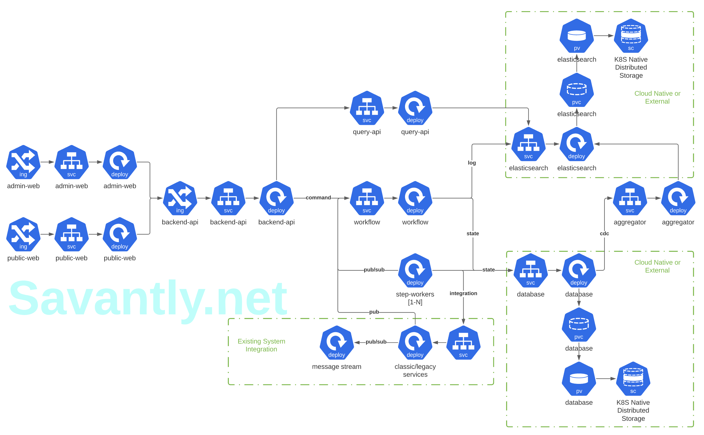

# cloud-native-microservice-arch
Reference K8S architecture for a cloud native, highly scalable, microservices deployment

Currently in the design phase.  
Follow this project, or [open/participate in a discussion](https://github.com/savantly-net/cloud-native-microservice-arch/discussions)  

## Goal
Provide a set of Kubernetes configs to standup all the necessary components for a highly scalable application platform centered around a collection of microservices.  

This repository should serve as a template for a new project, or as an upstream source for configuration.  
It will be somewhat opinionated, but extendable.  
It should be deployable to most K8S clusters, so the technology selections should be compatible with at least EKS, GKE, and minikube.

## High Level
A rough high level draft of how this architecture may be implemented.  

